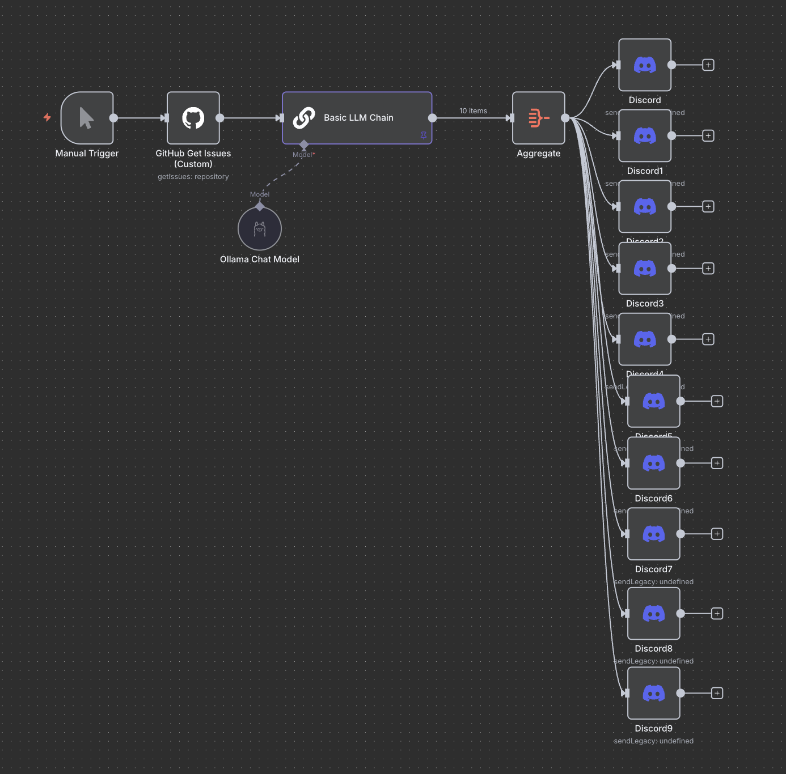

# Setup Instructions for pull-agent-n8n automation

This n8n automation fetches issues from a github repository, summerizes them with a local LLM using Ollama, and then sends them as a message to discord.

## Prerequisites
- Ollama installed on your computer
- A Github Account
- A discord account
- n8n installed on your computer

## Steps to set up the n8n automation:
1. Import the JASON file into n8n
2. Replaces the keys for Github and Discord with your own
3. Connect your ollama account to n8n
4. Run the automation!

## Limitations & Issues

### You can only summerize up to ten issues right now
It took me a while to get this automation working properly, I tried a lot of different methods but was having trouble pushing the summerizations to discord. So I made a different node for each issue message sent out to discord. You can change it if you have more issues for now until I find a better fix.

### Might be an issue where you need to set up the discord nodes to be connected to the text summaries

#### I will add comments to the automation soon for better guidence.
#### Feel free to edit this automation however you need!

## Screenshot of the automation

    